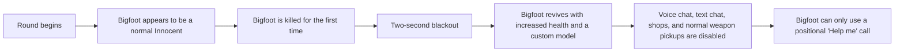

# Bigfoot Role for Trouble in Terrorist Town 2

A custom social-deduction game role for **Trouble in Terrorist Town 2 (TTT2)**, built in Lua for **Garry's Mod**.

Bigfoot begins the round disguised as an ordinary Innocent. The first time they are killed, they return as a stronger but feral version of themselves: unable to speak, unable to use normal weapons, and only able to call out for help with a positional sound.

[TTT2](https://github.com/TTT-2/TTT2) expands TTT with a framework for custom roles, equipment, settings, and win conditions. This repository adds one of those roles.

## What Bigfoot Does

Bigfoot is on the Innocent team, but their identity is concealed.



After transforming:

- Bigfoot revives with **300 health** by default.
- Their player model changes to the bundled Bigfoot model.
- Their existing weapons are removed.
- They cannot pick up standard weapons or buy equipment.
- They cannot use voice chat or text chat.
- They receive a custom **Help me** ability with a 2.5-second cooldown.
- Other players still do not see the Bigfoot role revealed in the scoreboard.

The transformed Bigfoot is intentionally excluded from victory calculations. This prevents an otherwise-finished round from continuing while other players hunt a high-health character who can no longer affect the result in the usual way.

## Example Round

Alice is secretly assigned Bigfoot but sees the normal Innocent role at the start of the round. Nobody else is told that Bigfoot exists.

When Alice is killed, her screen goes black for two seconds and tells her that she can no longer speak. She then revives as Bigfoot with extra health. Her inventory has been replaced by a single Help me action, so the only way she can communicate with nearby players is through the sound's location and timing.

The result is a small mechanical twist with a social consequence: other players have to decide whether the creature they can hear is useful, dangerous, or a distraction.

## Engineering Highlights

This addon is deliberately small, but it touches several parts of the TTT2 and Garry's Mod addon APIs:

- **Role lifecycle management:** resets per-player state between rounds and transforms Bigfoot only after their first death.
- **Client/server networking:** sends a timed blackout overlay and optional post-revival reminder from the server to the affected client.
- **Selective role synchronization:** presents different role information to Bigfoot and to other players to preserve the disguise.
- **Game-rule integration:** adjusts round-end checks so the transformed role does not block the normal victory flow.
- **Inventory restrictions:** strips the standard loadout, prevents normal weapon pickups, disables shop orders, and restores the custom ability after spawn timing events.
- **Communication restrictions:** blocks both voice and text chat after transformation.
- **Bundled assets:** includes a player model, materials, role icon, and positional sound effect.
- **Server configuration:** exposes health and reminder-popup options as console variables and in the TTT2 settings menu.

## Project Structure

```text
src/ttt2-role_bigfoot/
|-- addon.json                              # Garry's Mod addon metadata
|-- gamemodes/terrortown/entities/weapons/
|   `-- weapon_ttt2_helpme/shared.lua       # Positional Help me ability
|-- lua/terrortown/
|   |-- autorun/shared/                     # Console variables and weapon loading
|   |-- entities/roles/bigfoot/shared.lua   # Main role behavior
|   `-- lang/en/bigfoot.lua                 # English UI text
|-- materials/                              # Player textures and role icon
|-- models/                                 # Bigfoot player model
`-- sound/bigfoot/helpme.wav                # Positional Help me audio
```

## Configuration

The addon adds two server console variables:

| Console variable | Default | Purpose |
| --- | ---: | --- |
| `ttt2_bigfoot_hp` | `300` | Health assigned after Bigfoot transforms |
| `ttt2_bigfoot_popup` | `1` | Whether to show a post-revival reminder popup |

TTT2 also provides its usual role controls for enabling the role and tuning how often it appears. By default, Bigfoot is limited to one player and requires at least six players in the round.

## Running the Addon

### Requirements

- [Garry's Mod](https://store.steampowered.com/app/4000/Garrys_Mod/)
- A server running [TTT2](https://github.com/TTT-2/TTT2)

### Local Installation

Copy the addon folder into the Garry's Mod addons directory:

```text
src/ttt2-role_bigfoot/
```

becomes:

```text
garrysmod/addons/ttt2-role_bigfoot/
```

Start a TTT2 server and enable the Bigfoot role through the standard TTT2 role settings.
